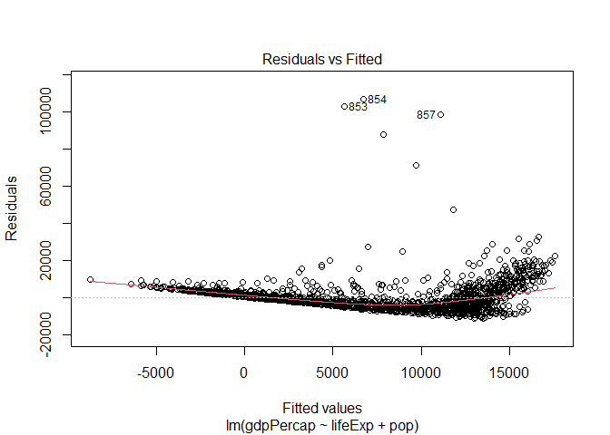
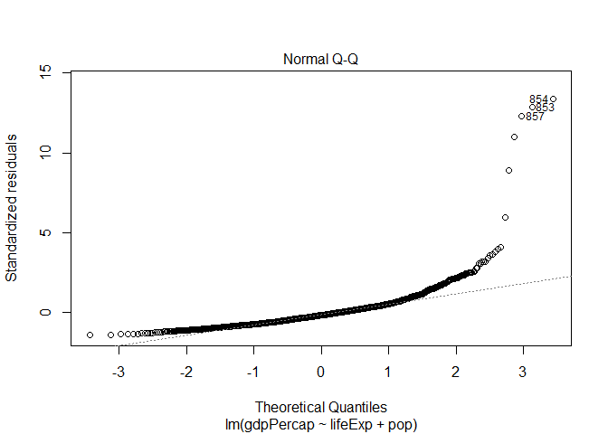
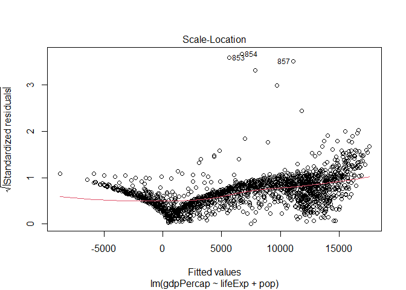
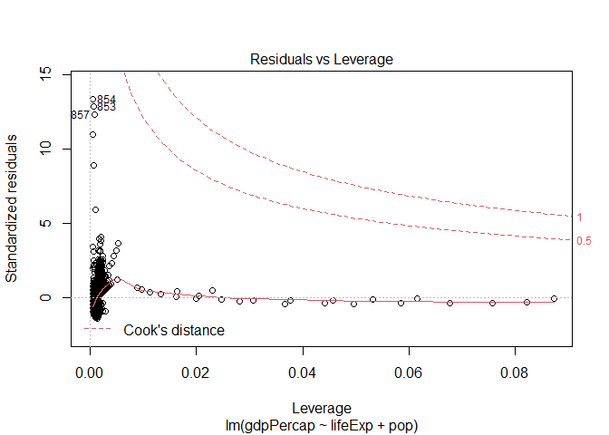

Assignment 1-B
================
Tianyi Zheng

Loading Packages

``` r
library(tidyverse)
library(gapminder)
library(testthat)
library(broom)
```

Exercise 1: Functions (10 points)
---------------------------------

### 1.1 Documentation and Design (5)

<!----------- Documentation goes here ---------------------->
**Description**

This function takes a dataset of two quantitative variables and fits a single linear regression model from the them,then it displays scatterplot with fitted regression line. Also, it displays any influential points as color red based on user defined critiria (cut-off for cook's distance).

**Input (Arguments)**

-   `data`: a dataframe with two quantitative variables.
-   *Justification*: Data means the data that would be used to fit the model and made the plot. There is no default value of data.
-   `xy`: logicals. If TRUE then the first column of the dataframe would assumed to be independent variable, and vice versa for FALSE. The default if TRUE.
-   *Justification*: xy means the first column is the independent variable in the regression model, and the second column is the dependent variable. The default is TRUE, which only indicate one of the two possibilties.
-   `cooksd`: a non-negative numercial value for cook's distance threshold. The default is 0.5.
-   *Justification*: Cooksd means the Cook's Distance for identifying influential observations. Emprically, a cook's distance above 0.5 would need to be examine, so the default is 0.5.
-   `na.action`: a function which indicates what should happen when the data contain NAs. The default is set by the na.action setting of options, and is na.fail if that is unset.
-   *Justification*: Na.action means default actions for NA values, and the setting is na.fail as what is in options.
-   `...`: additional arguments to be passed to the low level regression fitting functions.
-   *Justification*: The ellipsis allows for more generalizability.

**Output**

A scatterplot with fitted regression line, and red labelled influential points.

<!---------------------------------------------------------->
### 1.2 Write the Function (3)

<!------------ Write your function below here -------------->
<!---------------------------------------------------------->
### 1.3 Test the Function (2 points)

<table style="width:44%;">
<colgroup>
<col width="12%" />
<col width="19%" />
<col width="12%" />
</colgroup>
<thead>
<tr class="header">
<th>Rubric</th>
<th>Description</th>
<th>Points</th>
</tr>
</thead>
<tbody>
<tr class="odd">
<td>Choice</td>
<td>Your demonstrations aren't redundant; neither are the tests; selected inputs are useful to check</td>
<td>2</td>
</tr>
</tbody>
</table>

-   \[ \] Demonstrate the use of your function, using at least two non-redundant inputs.
-   \[ \] Write formal tests for your function. You should use at least three non-redundant uses of an `expect_()` function from the `testthat` package, and they should be contained in a `test_that()` function (or more than one).

Example of non-redundant inputs:

-   Vector with no NA's
-   Vector that has NA's
-   Vector of a different type (if relevant)
-   Vector of length 0, like `numeric(0)`.

Example of redundant inputs:

-   Each providing a different number (unless one of these numbers have some significance, like a limit point -- just tell us if that's the case)

<!------------ Test your function below here --------------->
<!---------------------------------------------------------->
### 1.4 (**Optional**, 1 bonus point)

Contribute to an open-source R package on GitHub by making an improvement to one of their functions, or perhaps even adding your function to their package. If you're nervous, maybe ask the developers first via a GitHub Issue or email (check their `CONTRIBUTING` file for more details, if they have one).

Note: You can't get above 100% on this assignment.

If you choose to do this, just put a link to the pull request that you made on the R package's GitHub repository. Your pull request doesn't need to be accepted by the developers, but your pull request *should* be realistic in order to get this bonus point.

**You can even do this after you submit the assignment**. For example, you might want to wait until we learn about R packages before you do this. If this is the case, just make sure to let your grader know once you submit your pull request, via a GitHub Issue in your homework repository (don't forget to `@tag` them!), also including a link to your pull request. But, you have until the deadline of Assignment 5-B to do this, and you only get one attempt!

------------------------------------------------------------------------

Exercise 2: List Columns (8 points)
-----------------------------------

### 2.1 (8 points)

<!------------ Put your work here -------------------------->
Check Gapminder Dataset

``` r
head(gapminder)
```

    ## # A tibble: 6 x 6
    ##   country     continent  year lifeExp      pop gdpPercap
    ##   <fct>       <fct>     <int>   <dbl>    <int>     <dbl>
    ## 1 Afghanistan Asia       1952    28.8  8425333      779.
    ## 2 Afghanistan Asia       1957    30.3  9240934      821.
    ## 3 Afghanistan Asia       1962    32.0 10267083      853.
    ## 4 Afghanistan Asia       1967    34.0 11537966      836.
    ## 5 Afghanistan Asia       1972    36.1 13079460      740.
    ## 6 Afghanistan Asia       1977    38.4 14880372      786.

1.  Create linear regression model column for each continent, to regress lifeExp and pop on gdpPercap

``` r
(gdpmodelPerContinent<-gapminder %>% 
  select(continent,lifeExp,pop,gdpPercap) %>% 
  nest(data=c(lifeExp,pop,gdpPercap)) %>% 
  mutate(model= map(data, ~{
    lm(gdpPercap~lifeExp+pop,data = .x)
  })))
```

    ## # A tibble: 5 x 3
    ##   continent data               model 
    ##   <fct>     <list>             <list>
    ## 1 Asia      <tibble [396 x 3]> <lm>  
    ## 2 Europe    <tibble [360 x 3]> <lm>  
    ## 3 Africa    <tibble [624 x 3]> <lm>  
    ## 4 Americas  <tibble [300 x 3]> <lm>  
    ## 5 Oceania   <tibble [24 x 3]>  <lm>

1.  Evaluate the model by getting the linear model coefficient into its seprate column

``` r
gdpCoef<-gdpmodelPerContinent %>% 
  mutate(coef= map(model, tidy))
```

1.  Print out the tibble so far.

``` r
gdpCoef
```

    ## # A tibble: 5 x 4
    ##   continent data               model  coef            
    ##   <fct>     <list>             <list> <list>          
    ## 1 Asia      <tibble [396 x 3]> <lm>   <tibble [3 x 5]>
    ## 2 Europe    <tibble [360 x 3]> <lm>   <tibble [3 x 5]>
    ## 3 Africa    <tibble [624 x 3]> <lm>   <tibble [3 x 5]>
    ## 4 Americas  <tibble [300 x 3]> <lm>   <tibble [3 x 5]>
    ## 5 Oceania   <tibble [24 x 3]>  <lm>   <tibble [3 x 5]>

1.  Unnest the coef column, and only keep relevant columns and the statistically significant (p-value less than 0.05) non-intercept terms.

``` r
gdpCoef %>% 
  unnest(coef) %>% 
  select(continent,model,term,p.value) %>% 
  filter(p.value<0.05) %>% 
  filter(term!="(Intercept)") 
```

    ## # A tibble: 9 x 4
    ##   continent model  term     p.value
    ##   <fct>     <list> <chr>      <dbl>
    ## 1 Asia      <lm>   lifeExp 8.43e-16
    ## 2 Asia      <lm>   pop     1.84e- 3
    ## 3 Europe    <lm>   lifeExp 1.01e-74
    ## 4 Africa    <lm>   lifeExp 1.34e-29
    ## 5 Africa    <lm>   pop     4.89e- 2
    ## 6 Americas  <lm>   lifeExp 2.56e-23
    ## 7 Americas  <lm>   pop     9.74e-32
    ## 8 Oceania   <lm>   lifeExp 5.32e-13
    ## 9 Oceania   <lm>   pop     1.87e- 3

5.Brief explaination: The final tibble in 4 shows the linear regression model (in the model column) result that regress lifeExp(life expectancy) and pop(population) on gdpPercap (GDP per capita) per continent. The final tibble only kept statistically significant (p-value less than 0.05 in p.value column) non-intercept terms(in the term column). <!---------------------------------------------------------->

### 2.2 (**Optional**, 1 bonus point)

Here, we still fit the model in the previous part, which regress lifeExp(life expectancy) and pop(population) on gdpPercap (GDP per capita). From the cook's distance plot, we can identify that record 853,854,857 are infuenltial observations. After looking up, those records belong to Kuwait. Kuwait is an interesting country in this case because althought it is not the country with highest life expectancy or population, it has the highest GDP per capita, in fact, more than twice for any other countries in the gapminder dataset.

``` r
model<-lm(gdpPercap~lifeExp+pop,data=gapminder)
plot(model)
```



``` r
gapminder[c(853,854,857),]
```

    ## # A tibble: 3 x 6
    ##   country continent  year lifeExp    pop gdpPercap
    ##   <fct>   <fct>     <int>   <dbl>  <int>     <dbl>
    ## 1 Kuwait  Asia       1952    55.6 160000   108382.
    ## 2 Kuwait  Asia       1957    58.0 212846   113523.
    ## 3 Kuwait  Asia       1972    67.7 841934   109348.

``` r
gapminder %>% 
  group_by(country) %>% 
  summarise(lifeExp=mean(lifeExp),pop=mean(pop),gdpPercap=mean(gdpPercap)) %>% 
  arrange(desc(gdpPercap))
```

    ## `summarise()` ungrouping output (override with `.groups` argument)

    ## # A tibble: 142 x 4
    ##    country       lifeExp        pop gdpPercap
    ##    <fct>           <dbl>      <dbl>     <dbl>
    ##  1 Kuwait           68.9   1206496.    65333.
    ##  2 Switzerland      75.6   6384293.    27074.
    ##  3 Norway           75.8   4031441.    26747.
    ##  4 United States    73.5 228211232.    26261.
    ##  5 Canada           74.9  24462967.    22411.
    ##  6 Netherlands      75.6  13786798.    21749.
    ##  7 Denmark          74.4   4994187.    21672.
    ##  8 Germany          73.4  77547043.    20557.
    ##  9 Iceland          76.5    226978.    20531.
    ## 10 Austria          73.1   7583298.    20412.
    ## # ... with 132 more rows
