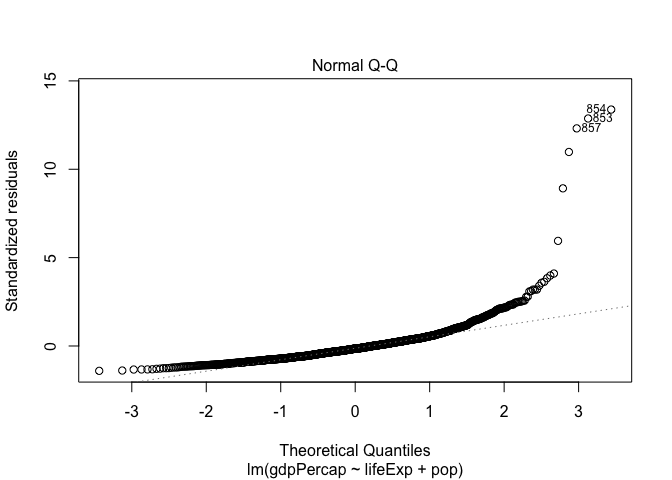
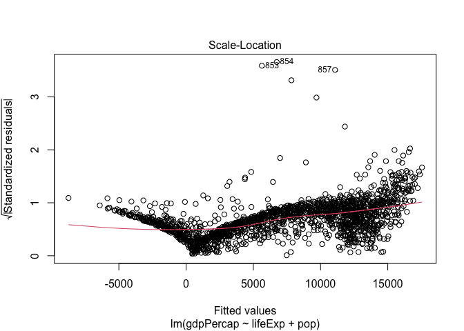

Assignment 1-B
================
Tianyi Zheng

Loading Packages

``` r
library(tidyverse)
library(gapminder)
library(testthat)
library(broom)
```

## Exercise 1: Functions (10 points)

### 1.1 Documentation and Design (5)

<!----------- Documentation goes here ---------------------->

**Description**

This function takes a dataset(as a list, and dataframes/tibbles are
lists) of two quantitative variables and fits a single linear regression
model from them, then it displays a scatterplot with fitted regression
line. Also, it displays any influential points as red color based on
user defined criteria (cut-off for cook’s distance).

**Input (Arguments)**

  - `data`: a list (dataframe, tibble, etc…) with two quantitative
    variables.
      - *Justification*: Data means the data that would be used to fit
        the model and made the plot. There is no default value of data.
  - `xy`: logicals. If TRUE then the first column of the list would
    assumed to be the independent variable, and vice versa for FALSE.
    The default if TRUE.
      - *Justification*: xy means the first column is the independent
        variable (x) in the regression model, and the second column is
        the dependent variable (y). The default is TRUE, which is
        consistent with ‘xy’.
  - `cooksd`: a non-negative numerical value for cook’s distance
    threshold. The default is 0.5.
      - *Justification*: Cooksd means the Cook’s Distance for
        identifying influential observations. Empirically, a cook’s
        distance above 0.5 would need to be examined, so the default is
        0.5.
  - `outputcount`: logicals. If TRUE then print a message on the count
    of influential observations.
      - *Justification*: Outputcount means print out the count of
        influential observations, and it is safer to not printing when
        user did not specify.
  - `verbose`: logicals. If TRUE then print a message to inform the user
    that the process is running.
      - *Justification*: Verbose is a widely accepted terminology for
        including message feedback, and it is safer to not include when
        user did not specify.
  - `...`: additional arguments to be passed to the low level regression
    fitting functions.
      - *Justification*: The ellipsis allows for more generalizability.

**Output**

A ggplot object(scatterplot) with fitted regression line and red
labelled influential points.

  - *Justification*: The purpose of this function is to create a data
    visualization to indicate influential observations in linear
    bivariate analysis.

<!---------------------------------------------------------->

### 1.2 Write the Function (3)

<!------------ Write your function below here -------------->

Error Messages Justification: Data needs to be a list of two
quantitative variables in order to fit linear regression model and
create scatter plot. Xy needs a non-negative number, and
cooksd,outputcount,verbose needs to be boolean. The process would not
make sense with unexpected inputs, therefore it should stop.

``` r
scatterinfobs<-function(data, xy=TRUE, cooksd=0.5, outputcount=FALSE, verbose=FALSE,...){
  if(typeof(data)!="list"){
    stop('The function expect input data as list\n',
         'but the input is: ', typeof(data)[1])
  }
  if(ncol(data)!=2){
    stop('The function expect two columns\n',
         'but the input has: ', ncol(data))
  }
  if(!is.numeric(data[[1]])|!is.numeric(data[[2]])){
    stop('The function expect quantinative/numberic variables.')
  }
  if(!is.numeric(cooksd)|cooksd<0){
    stop('cooksd needs to be a non-negative number')
  }
  if(!is.logical(xy)){
    stop('xy needs to be a boolean value')
  }
  if(!is.logical(outputcount)){
    stop('outputcount needs to be a boolean value')
  }
  if(!is.logical(verbose)){
    stop('verbose needs to be a boolean value')
  }  
  if(xy==TRUE){
    x=data[[1]]
    y=data[[2]]
    xname=colnames(data)[1]
    yname=colnames(data)[2]
   
  }
  if(xy==FALSE){
    x=data[[2]]
    y=data[[1]]
    xname=colnames(data)[2]
    yname=colnames(data)[1]
   
  }
 model<-lm(y~x,...)
 if(verbose==TRUE){
   cat("Linear model fitting done, now creating plot...")
 }
 
 if(outputcount==TRUE){
   Infobvec<-as.vector(cooks.distance(model)>cooksd)
   Infobnum<-length(subset(Infobvec,Infobvec==TRUE))
   cat("We have",Infobnum,"influential observations","at",cooksd,"cook's distance threshold")
 }
data %>% 
  mutate(Infob=cooks.distance(model)>cooksd) %>% 
  ggplot(aes(x,y))+
  geom_point(aes(color=Infob))+
  geom_smooth(method=lm, se=FALSE)+
  scale_color_manual(values=c("Black", "Red"))+ 
  theme_bw()+
  labs(x=xname,y=yname)+
  theme(legend.position = "none")
}
```

<!---------------------------------------------------------->

### 1.3 Test the Function (2 points)

<!------------ Test your function below here --------------->

``` r
scatterinfobs(gapminder %>% 
                select(lifeExp,pop))
```

    ## `geom_smooth()` using formula 'y ~ x'

<!-- -->

``` r
scatterinfobs(gapminder %>% 
                select(pop,lifeExp),xy=FALSE,cooksd=0.05,verbose = TRUE,outputcount = TRUE)
```

    ## Linear model fitting done, now creating plot...We have 4 influential observations at 0.05 cook's distance threshold

    ## `geom_smooth()` using formula 'y ~ x'

<!-- -->

``` r
scatterinfobs(gapminder %>% 
                select(lifeExp,gdpPercap),cooksd = 0.05)
```

    ## `geom_smooth()` using formula 'y ~ x'

<!-- -->

``` r
test_that("Unexpected Input Testing",{
expect_error(scatterinfobs(data=gapminder %>% 
                select(country,pop)))
expect_error(scatterinfobs(data=gapminder %>% 
                select(gdpPercap,pop),xy=1))
expect_error(scatterinfobs(data=gapminder %>% 
                select(gdpPercap,pop),verbose ="TRUE"))
expect_error(scatterinfobs(data=gapminder %>% 
                select(gdpPercap,pop),outputcount = 0))
expect_error(scatterinfobs(data=gapminder %>% 
                select(year,country,pop)))
expect_error(scatterinfobs(data=FALSE))
expect_error(scatterinfobs(data=gapminder %>% 
                select(gdpPercap,pop),cooksd = "0.5"))
  
})

test_that("Output check",{
expect_equal(class(scatterinfobs(data=gapminder %>% 
                select(gdpPercap,pop))),c("gg","ggplot"))
expect_output(scatterinfobs(data=gapminder %>% 
                select(gdpPercap,pop),outputcount = TRUE))
})
```

<!---------------------------------------------------------->

## Exercise 2: List Columns (8 points)

### 2.1 (8 points)

<!------------ Put your work here -------------------------->

Check Gapminder Dataset

``` r
head(gapminder)
```

    ## # A tibble: 6 x 6
    ##   country     continent  year lifeExp      pop gdpPercap
    ##   <fct>       <fct>     <int>   <dbl>    <int>     <dbl>
    ## 1 Afghanistan Asia       1952    28.8  8425333      779.
    ## 2 Afghanistan Asia       1957    30.3  9240934      821.
    ## 3 Afghanistan Asia       1962    32.0 10267083      853.
    ## 4 Afghanistan Asia       1967    34.0 11537966      836.
    ## 5 Afghanistan Asia       1972    36.1 13079460      740.
    ## 6 Afghanistan Asia       1977    38.4 14880372      786.

1.  Create linear regression model column for each continent, to regress
    lifeExp and pop on gdpPercap

<!-- end list -->

``` r
(gdpmodelPerContinent<-gapminder %>% 
  select(continent,lifeExp,pop,gdpPercap) %>% 
  nest(data=c(lifeExp,pop,gdpPercap)) %>% 
  mutate(model= map(data, ~{
    lm(gdpPercap~lifeExp+pop,data = .x)
  })))
```

    ## # A tibble: 5 x 3
    ##   continent data               model 
    ##   <fct>     <list>             <list>
    ## 1 Asia      <tibble [396 × 3]> <lm>  
    ## 2 Europe    <tibble [360 × 3]> <lm>  
    ## 3 Africa    <tibble [624 × 3]> <lm>  
    ## 4 Americas  <tibble [300 × 3]> <lm>  
    ## 5 Oceania   <tibble [24 × 3]>  <lm>

2.  Evaluate the model by getting the linear model coefficient into its
    separate column

<!-- end list -->

``` r
gdpCoef<-gdpmodelPerContinent %>% 
  mutate(coef= map(model, tidy))
```

3.  Print out the tibble so far.

<!-- end list -->

``` r
gdpCoef
```

    ## # A tibble: 5 x 4
    ##   continent data               model  coef            
    ##   <fct>     <list>             <list> <list>          
    ## 1 Asia      <tibble [396 × 3]> <lm>   <tibble [3 × 5]>
    ## 2 Europe    <tibble [360 × 3]> <lm>   <tibble [3 × 5]>
    ## 3 Africa    <tibble [624 × 3]> <lm>   <tibble [3 × 5]>
    ## 4 Americas  <tibble [300 × 3]> <lm>   <tibble [3 × 5]>
    ## 5 Oceania   <tibble [24 × 3]>  <lm>   <tibble [3 × 5]>

4.  Unnest the coef column, and only keep relevant columns and the
    statistically significant (p-value less than 0.05) non-intercept
    terms.

<!-- end list -->

``` r
gdpCoef %>% 
  unnest(coef) %>% 
  select(continent,model,term,p.value) %>% 
  filter(p.value<0.05) %>% 
  filter(term!="(Intercept)") 
```

    ## # A tibble: 9 x 4
    ##   continent model  term     p.value
    ##   <fct>     <list> <chr>      <dbl>
    ## 1 Asia      <lm>   lifeExp 8.43e-16
    ## 2 Asia      <lm>   pop     1.84e- 3
    ## 3 Europe    <lm>   lifeExp 1.01e-74
    ## 4 Africa    <lm>   lifeExp 1.34e-29
    ## 5 Africa    <lm>   pop     4.89e- 2
    ## 6 Americas  <lm>   lifeExp 2.56e-23
    ## 7 Americas  <lm>   pop     9.74e-32
    ## 8 Oceania   <lm>   lifeExp 5.32e-13
    ## 9 Oceania   <lm>   pop     1.87e- 3

5.Brief explanation: The final tibble in 4 shows the linear regression
model (in the model column) result that regress lifeExp(life expectancy)
and pop(population) on gdpPercap (GDP per capita) per continent. The
final tibble only kept statistically significant (p-value less than 0.05
in p.value column) non-intercept terms (in the term column).
<!---------------------------------------------------------->

### 2.2 (**Optional**, 1 bonus point)

Here, we still fit the model in the previous part, which regress
lifeExp(life expectancy) and pop(population) on gdpPercap (GDP per
capita). From the cook’s distance plot, we can identify that record
853,854,857 are influential observations. After looking up, those
records belong to Kuwait. Kuwait is an interesting country in this case
because although it is not the country with highest life expectancy or
population, it has the highest GDP per capita, in fact, more than twice
for any other countries in the gapminder dataset.

``` r
model<-lm(gdpPercap~lifeExp+pop,data=gapminder)
plot(model)
```

<!-- --><!-- --><!-- --><!-- -->

``` r
gapminder[c(853,854,857),]
```

    ## # A tibble: 3 x 6
    ##   country continent  year lifeExp    pop gdpPercap
    ##   <fct>   <fct>     <int>   <dbl>  <int>     <dbl>
    ## 1 Kuwait  Asia       1952    55.6 160000   108382.
    ## 2 Kuwait  Asia       1957    58.0 212846   113523.
    ## 3 Kuwait  Asia       1972    67.7 841934   109348.

``` r
gapminder %>% 
  group_by(country) %>% 
  summarise(lifeExp=mean(lifeExp),pop=mean(pop),gdpPercap=mean(gdpPercap)) %>% 
  arrange(desc(gdpPercap))
```

    ## `summarise()` ungrouping output (override with `.groups` argument)

    ## # A tibble: 142 x 4
    ##    country       lifeExp        pop gdpPercap
    ##    <fct>           <dbl>      <dbl>     <dbl>
    ##  1 Kuwait           68.9   1206496.    65333.
    ##  2 Switzerland      75.6   6384293.    27074.
    ##  3 Norway           75.8   4031441.    26747.
    ##  4 United States    73.5 228211232.    26261.
    ##  5 Canada           74.9  24462967.    22411.
    ##  6 Netherlands      75.6  13786798.    21749.
    ##  7 Denmark          74.4   4994187.    21672.
    ##  8 Germany          73.4  77547043.    20557.
    ##  9 Iceland          76.5    226978.    20531.
    ## 10 Austria          73.1   7583298.    20412.
    ## # … with 132 more rows
