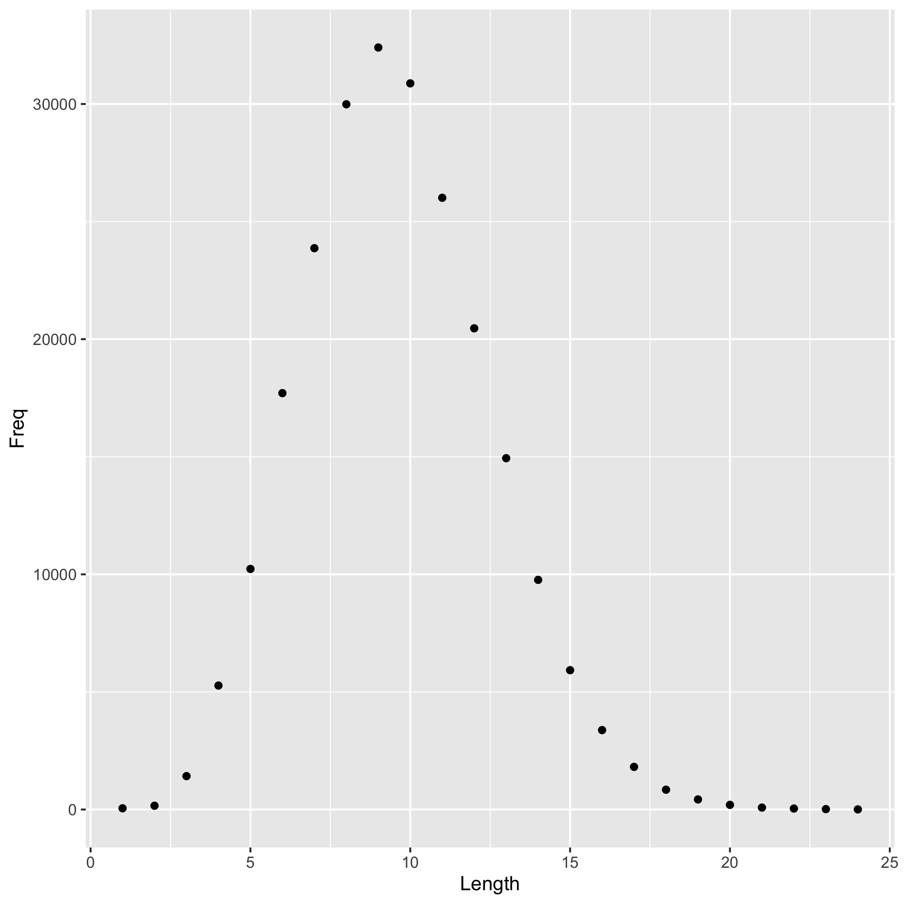
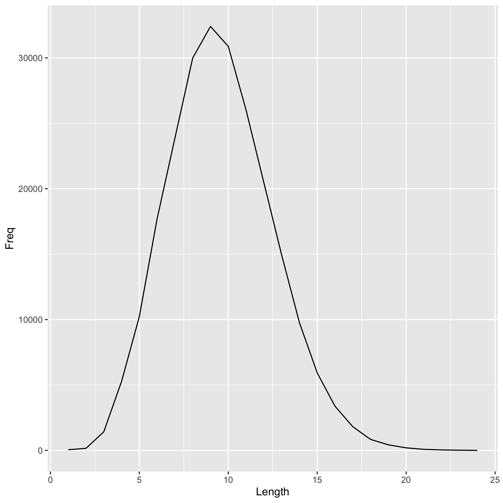

On most *nix systems, the file `/usr/share/dict/words` contains a bunch of words. On my machine, it contains 235886 words.

I computed the length of each word, i.e. the number of characters, and tabulated how many words consist of 1 character, 2 characters, etc.

The most frequent word length is 9.

Here are histograms (discrete and continuous) of word lengths.

