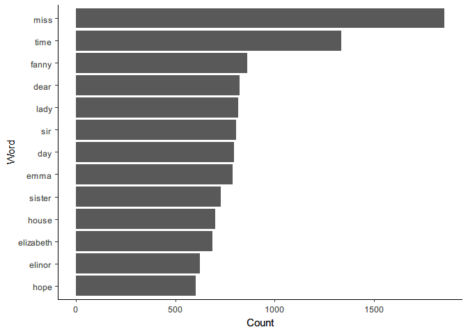

Assignment 5-B
================
Tianyi Zheng

## Overview

  - **Option A:** Strings Regex

## Option A – Strings in R

### Exercise 1 (9 points)

Load the packages.

``` r
library(tidyverse)
```

    ## -- Attaching packages ---------------------- tidyverse 1.3.0 --

    ## v ggplot2 3.3.2     v purrr   0.3.4
    ## v tibble  3.0.3     v dplyr   1.0.2
    ## v tidyr   1.1.2     v stringr 1.4.0
    ## v readr   1.3.1     v forcats 0.5.0

    ## -- Conflicts ------------------------- tidyverse_conflicts() --
    ## x dplyr::filter() masks stats::filter()
    ## x dplyr::lag()    masks stats::lag()

``` r
library(tidytext)
```

    ## Warning: package 'tidytext' was built under R version 4.0.3

``` r
library(janeaustenr)
```

    ## Warning: package 'janeaustenr' was built under R version 4.0.3

Here we look into Jane Austen’s 6 books and transform it into tidytext
format. Then convert the tidytext to lower cases and also remove any
stop words.

``` r
   (JAtidy<-austen_books() %>%
   group_by(book) %>%
   unnest_tokens(word, text) %>% 
   anti_join(stop_words) %>% 
   ungroup())
```

    ## Joining, by = "word"

    ## Warning in NextMethod(): number of items to replace is not a multiple of
    ## replacement length

    ## # A tibble: 217,609 x 2
    ##    book                word       
    ##    <fct>               <chr>      
    ##  1 Sense & Sensibility sense      
    ##  2 Sense & Sensibility sensibility
    ##  3 Sense & Sensibility jane       
    ##  4 Sense & Sensibility austen     
    ##  5 Sense & Sensibility 1811       
    ##  6 Sense & Sensibility chapter    
    ##  7 Sense & Sensibility 1          
    ##  8 Sense & Sensibility family     
    ##  9 Sense & Sensibility dashwood   
    ## 10 Sense & Sensibility settled    
    ## # ... with 217,599 more rows

We visualize the word count from the 6 books by a bar chart, and filter
by word count above 600 to get the most common words.

``` r
JAtidy %>% 
  count(word, sort = TRUE) %>% 
  filter(n > 600) %>% 
  ggplot(aes(n,reorder(word,n)))+
  geom_col() +
  ylab("Word")+
  xlab("Count")+
  theme_classic()
```

<!-- -->

### Exercise 2 (9 points)

Load the testing package.

``` r
library(testthat)
```

    ## 
    ## Attaching package: 'testthat'

    ## The following object is masked from 'package:dplyr':
    ## 
    ##     matches

    ## The following object is masked from 'package:purrr':
    ## 
    ##     is_null

    ## The following object is masked from 'package:tidyr':
    ## 
    ##     matches

#### 2.1 Documentation and Design

**Description**

This function takes a string(char) or an atomic vector of strings(char)
and translate it into the Minions language. Specifically, there are 6
rules:

1.  If the word start with a vowel letter, move the vowel letter to the
    end and add “nana” to it.

2.  If the word start with “T” or “H”, convert it to a “B” and add “la”
    at the end.

3.  If the word start with at least 2 vowel letters in the first 3
    letters (can be YNY, YYN, NYY, YYY), move all 3 letters to the end
    and add “lalala” to the end.

4.  If the word is “banana”(not case-sensitive), convert it to
    “BA-NA-NA\!”

5.  Since the translation is designed for words only, any non-letter
    characters (numbers, symbols…) will be ignored.

6.  If none of the above rules apply, return the original word.

**Input (Arguments)**

  - `data`: a string(char) or an atomic vector of strings(char).
      - *Justification*: Since the function is translating, only
        character would make sense, so the acceptable datatype is
        character, which can be a single word or an atomic vector of
        words. Lists are not supported by the function because it would
        need to iterate through each element to validate the datatype,
        which is not performance-wise.

**Output**

A string(char) or an atomic vector of strings(char) that translated into
the Minions language.

  - *Justification*: Since the functionality is only translating, the
    datatype is not expected to be changed.

#### 2.2 Function

This is a helper function that applies rules to a single word(char).

``` r
MinionsTranslatorSingle<-function(data){
  data<-tolower(data)
  
  if(length(data)==1){
    if(tolower(data)=="banana"){
      return("BA-NA-NA!")
    }
    if(length((str_subset(data,"^[Tt]|^[Hh]")))>0)
       {
         return(paste0("b",str_sub(data, start=2),"la"))
    }
    if(length((str_subset(data,"^[A-z][aeiouAEIOU][aeiouAEIOU]|^[aeiouAEIOU][A-z][aeiouAEIOU]|^[aeiouAEIOU][aeiouAEIOU][A-z]|^[aeiouAEIOU][aeiouAEIOU][aeiouAEIOU]")))>0)
    {
      return(paste0(str_sub(data, start=4),str_sub(data, start=1, end=3),"lalala"))
    }
    if(length((str_subset(data,"^[aeiouAEIOU]")))>0)
    {
      return(paste0(str_sub(data, start=2),str_sub(data, start=1, end=1),"nana"))
    }
    
    else{
    data
    }
  }
}
```

This is the main function.

``` r
MinionsTranslator<-function(data){
  if(typeof(data)!="character"){
    stop('The function expect input data as character\n',
         'but the input is: ', typeof(data)[1])
  }
  
  data<-tolower(str_remove_all(data,"[^A-z]"))
  
  map_chr(data,MinionsTranslatorSingle)

}
```

#### 2.3 Test the Function

Examples:

``` r
MinionsTranslator("banana")
```

    ## [1] "BA-NA-NA!"

``` r
MinionsTranslator(c("Apple","austin","Canada"))
```

    ## [1] "ppleanana"    "tinauslalala" "canada"

3 tests on unexpected input types, main function output and helper
function outpout.

``` r
test_that("Unexpected Input Testing",{
expect_error(MinionsTranslator(list("abc","bcd")))
expect_error(MinionsTranslator(1))
expect_error(MinionsTranslator(NULL))
})

test_that("Output check",{
expect_equal(MinionsTranslator(c("obvious","area","banana")),c("bviousonana", "aarelalala", "BA-NA-NA!"))
expect_equal(MinionsTranslator(c("obvi@us","1a2b3c4d")),c("bviusonana", "bcdanana"))
})

test_that("Helper Function Testing",{
expect_equal(MinionsTranslatorSingle("orange"),"ngeoralalala")
expect_equal(MinionsTranslatorSingle("Alien"), "enalilalala")
expect_equal(MinionsTranslatorSingle("why"),"why")
expect_equal(MinionsTranslatorSingle("Zoo"),"zoolalala")
})
```
